# Physics Question Bank
## Topics: Force - Moment of Force, Couple, Equilibrium, Centre of Gravity & Uniform Circular Motion

---

# SECTION A: MOMENT OF FORCE & COUPLE / EQUILIBRIUM

---

## Year: 2019

### Question 1a (2 Marks)
The diagram below shows a claw hammer used to remove a nail:

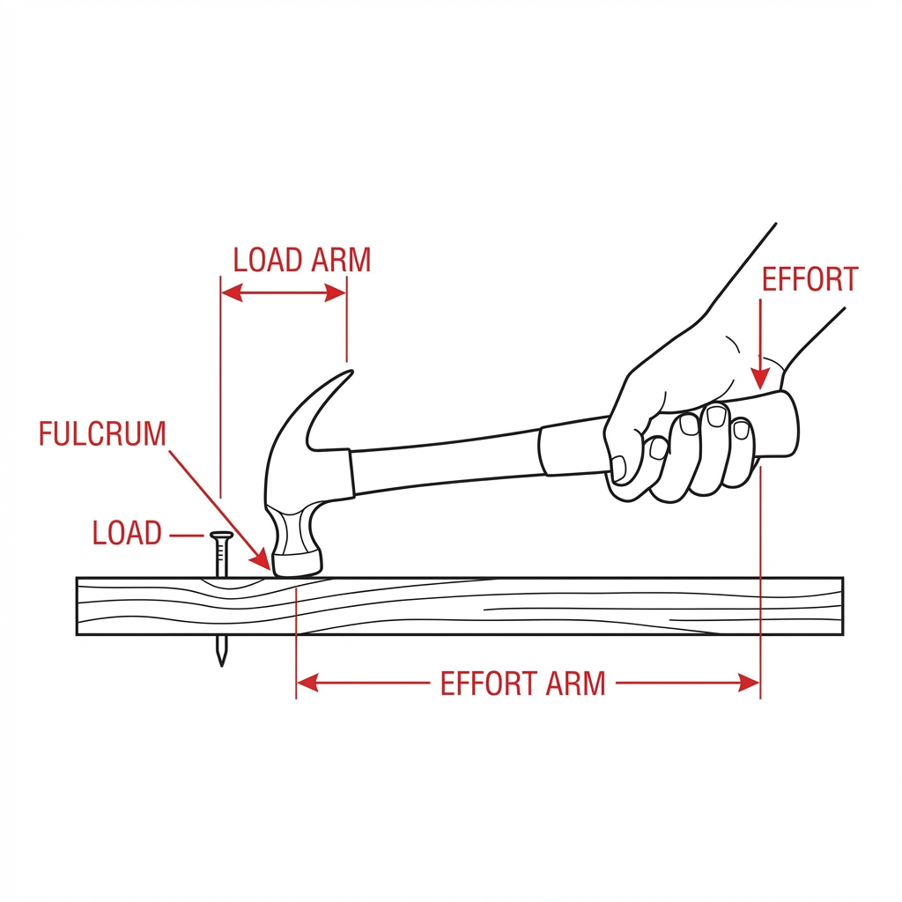

(i) To which class of lever does it belong?

(ii) Give one more example of the same class of lever mentioned by you in (i) for which the mechanical advantage is greater than one.

---

### Question 1d (2 Marks)
(i) Define couple.

(ii) State the S.I. unit of moment of couple.

---

### Question 5b (3 Marks)
A uniform meter scale is in equilibrium as shown in the diagram:

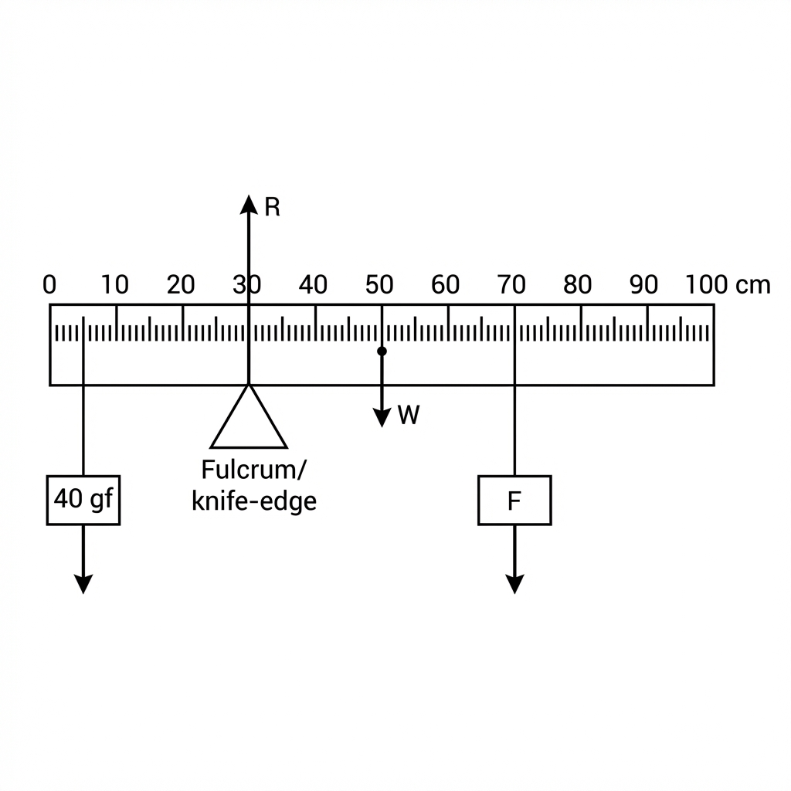

(i) Calculate the weight of the meter scale.

(ii) Which of the following options is correct to keep the ruler in equilibrium when 40 gf wt is shifted to 0 cm mark?
- F is shifted towards 0 cm, or
- F is shifted towards 100 cm.

---

### Question 5c (4 Marks)
The diagram below shows a pulley arrangement:

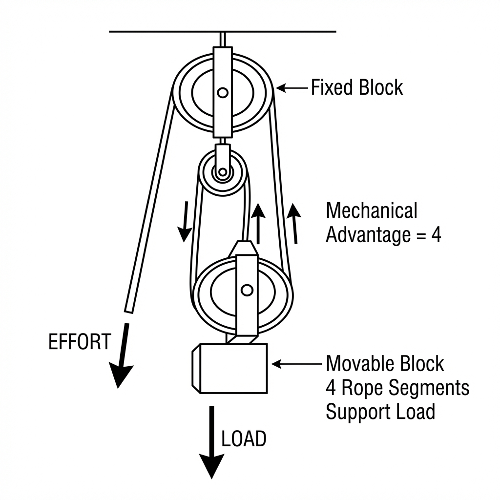

(i) Copy the diagram and mark the direction of tension on each strand of the string.

(ii) What is the velocity ratio of the arrangement?

(iii) If the tension acting on the string is T, then what is the relationship between T and effort E?

(iv) If the free end of the string moves through a distance x, find the distance by which the load is raised.

---

## Year: 2020

### Question 1a (2 Marks)
(i) Define moment of force.

(ii) Write the relationship between the SI and CGS unit of moment of force.

---

### Question 1d (2 Marks)
(i) Identify the class of the lever shown in the diagram below:

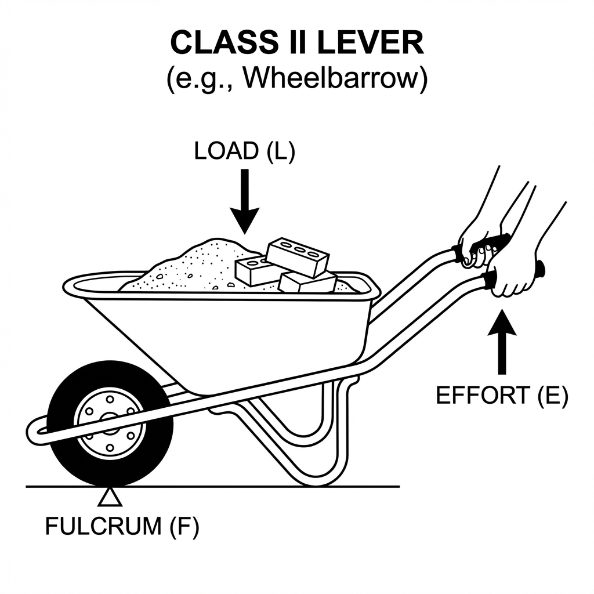

(ii) How is it possible to increase the M.A. of the above lever without increasing its length?

---

### Question 5c (Block and Tackle System)
A block and tackle system of pulleys has velocity ratio 4.

(i) Draw a neat labelled diagram of the system indicating clearly the points of application and direction of load and effort.

(ii) What will be its V.R. if the weight of the movable block is doubled?

---

## Year: 2021

### Question 8 (1 Mark)
The relation between CGS and S.I. unit of moment of force is:
(a) 1 Nm = 10⁵ dyne cm
(b) 1 Nm = 10⁵ dyne
(c) 1 Nm = 10⁷ dyne cm
(d) 1 dyne cm = 10⁷ N m

---

### Question 11 (1 Mark)
The diagram below shows the balanced position of a metre scale.

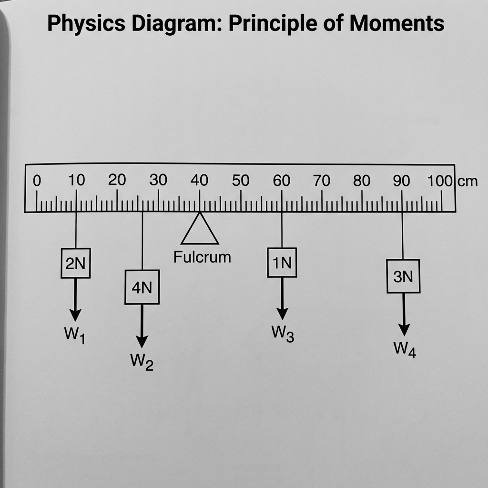

Which one of the following diagrams shows the correct position of the scale when it is supported at the centre?

(a) Left side tilts down
(b) Right side tilts down
(c) Remains balanced
(d) Cannot be determined

---

### Question 14 (1 Mark)
A woman draws water from a well using a fixed pulley. The mass of the bucket and the water together is 10 kg. The force applied by the woman is 200 N. The mechanical advantage is (g = 10 m/s²):
(a) 2
(b) 20
(c) 0.05
(d) 0.5

---

### Question 15 (1 Mark)
A single fixed pulley is used because:
(a) it changes the direction of applied effort conveniently.
(b) it multiplies speed.
(c) it multiplies effort.
(d) its efficiency is 100%.

---

### Question 16 (1 Mark)
In the diagram shown below, the velocity ratio of the arrangement is:

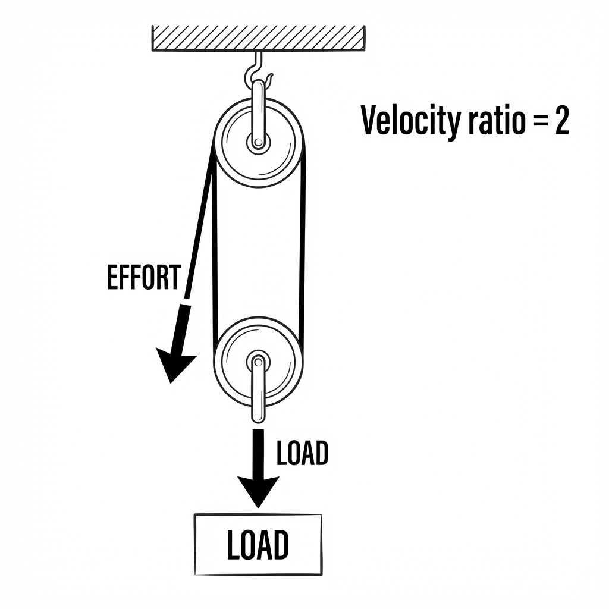

(a) 1
(b) 2
(c) 3
(d) 0

---

## Year: 2023

### Question 1(i) (1 Mark)
Clockwise moment produced by a force about a fulcrum is considered to be:
(a) Positive
(b) Negative
(c) Zero
(d) None of these

---

### Question 2(i)(b) (1 Mark)
Name a single pulley in which displacement of load and effort is not the same.

---

### Question 2(i)(c) (1 Mark)
State one advantage of this pulley.

---

### Question 2(iii) (2 Marks)
The diagram shows wheel O pivoted at point A. Three equal forces F₁, F₂ and F₃ act at point B on the wheel.

(a) Which force will produce maximum moment about A?

(b) Give a reason for your answer in (a).

---

### Question 2(iv)(a) (1 Mark)
What should be the angle between the direction of force and the direction of displacement for work to be negative?

---

### Question 6(i) (3 Marks)
A block and tackle system of pulleys has velocity ratio 4.

(a) Draw a labelled diagram of the system indicating clearly, the direction of the load and the effort.

(b) What is the value of the mechanical advantage of the given pulley system if it is an ideal pulley system?

---

### Question 6(ii) (3 Marks)
A metre scale of weight 50 gf can be balanced at 40 cm mark without any weight suspended on it.

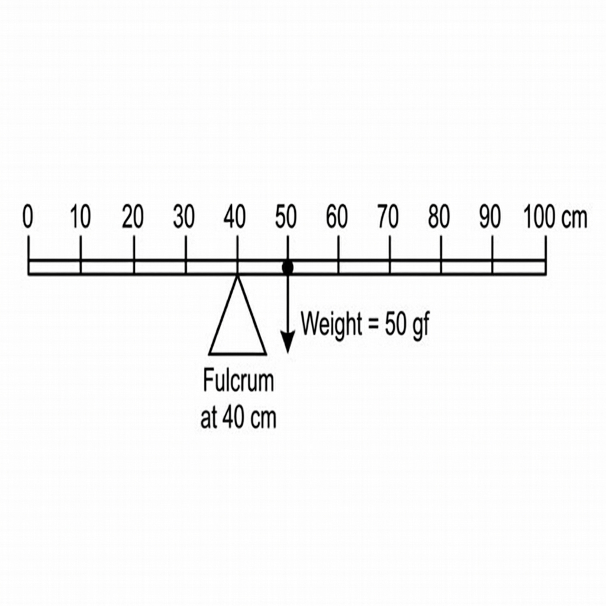

(a) If this ruler is cut at its centre then state which part [0 to 50 cm or 50 to 100 cm] of the ruler will weigh more than 25 gf?

(b) What minimum weight placed on this metre ruler can balance this ruler when it is pivoted at its centre?

---

## Year: 2024

### Question 1.2 (1 Mark)
A door lock is opened by turning the lever (handle) of length 0.2 m. If the moment of force produced is 1 Nm, then the minimum force required is:
(a) 5 N
(b) 10 N
(c) 20 N
(d) 0.2 N

---

### Question 1.7 (1 Mark)
Which of the following is a class III lever?
(a) Pair of scissors
(b) Wheelbarrow
(c) Crowbar
(d) Human forearm

---

### Question 2.1(b) (1 Mark)
Name the class of the lever shown in the picture below:

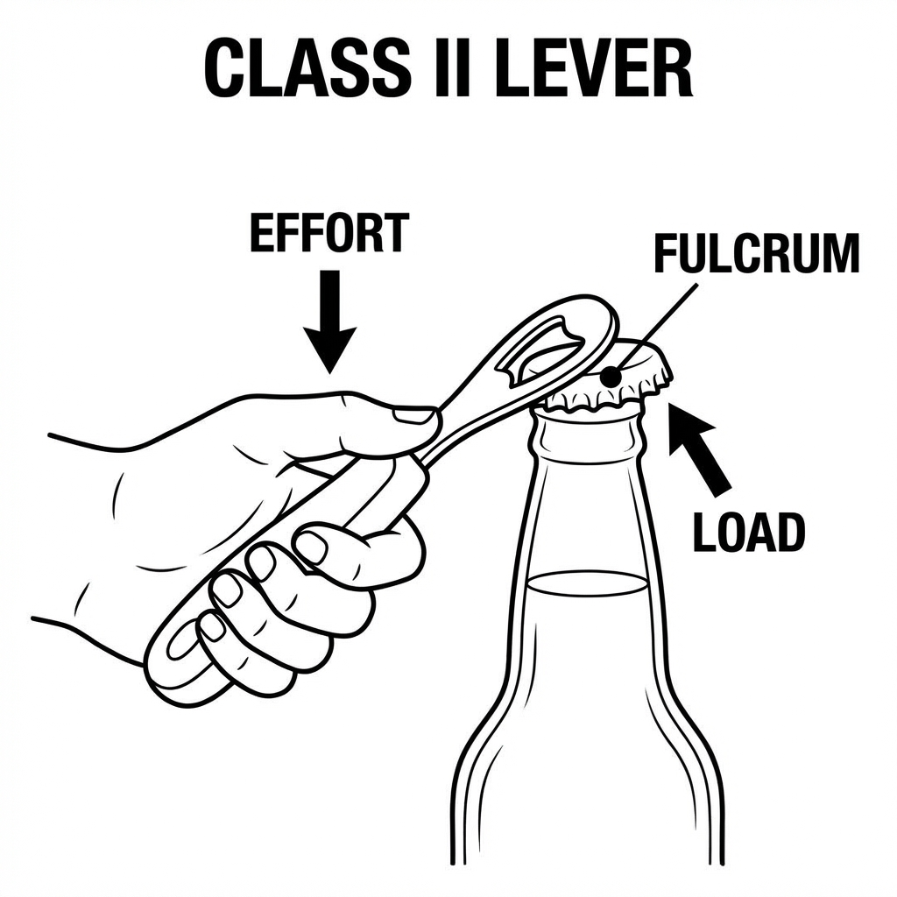

---

### Question 2.3 (2 Marks)
A non-uniform beam of weight 120 N pivoted at one end is shown in the diagram below. Calculate the value of F to keep the beam in equilibrium.

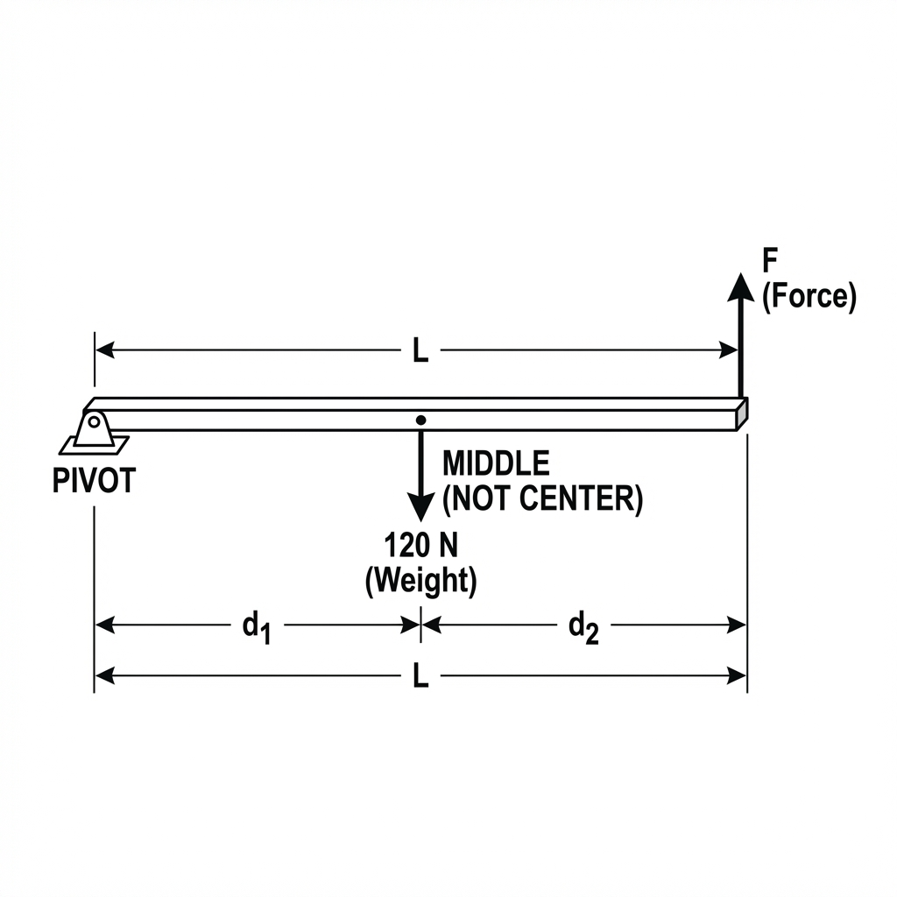

---

### Question 2.4(a) (1 Mark)
Meera chose to use a block and tackle system of '9' pulleys instead of a single movable pulley to lift a heavy load.

What is the advantage of using a block and tackle system over a single movable pulley?

---

### Question 2.4(b) (1 Mark)
Meera chose to use a block and tackle system of '9' pulleys instead of a single movable pulley to lift a heavy load.

Why should she connect more number of pulleys in the upper fixed block?

---

### Question 6.3(a) (2 Marks)
Copy and complete the labelled diagram connecting the two pulleys with a tackle to obtain Velocity Ratio = 2.

---

### Question 6.3(b) (2 Marks)
If Load = 48 kgf and efficiency is 80% then calculate:
1. Mechanical Advantage.
2. Effort needed to lift the load.

---

## Year: 2025

### Question 1(i) (1 Mark)
A body is acted upon by two equal and opposite forces, that are NOT along the same straight line. The body will:
(a) remain stationary
(b) have only rotational motion
(c) have only rectilinear motion
(d) have both rectilinear and rotational motion

---

### Question 1(ii) (1 Mark)
Which among the following is a vector quantity?
(a) work
(b) power
(c) energy
(d) moment of couple

---

### Question 1(vi) (1 Mark)
For a lever, a graph is plotted with load on Y-axis and effort on X-axis. Which of the following represents the slope of the graph?

*[Diagram: A graph showing Load vs Effort relationship for a lever]*
(a) Mechanical advantage
(b) Velocity ratio
(c) 1/Velocity ratio
(d) 1/Mechanical advantage

---

### Question 6(i) (3 Marks)
Akash takes a uniform metre scale and suspends a weight of 2 N at one end 'X', and a weight of 5 N on the other end 'Y". He then balances the ruler horizontally on a knife edge placed at 70 cm from X. Draw a diagram of the arrangement and calculate the weight of the ruler.

---

### Question 6(ii) (3 Marks)
Three levers X, Y, Z of equal lengths are shown in the diagram.

(a) Which class of lever do these belong to?

(b) Among these (X, Y or Z) which one will give the maximum mechanical advantage? Justify your answer.

---

### Question 6(iii) (4 Marks)
Richa weighing 40 kgf leaves point P on her skateboard and reaches point Q on the ground with velocity 10 ms⁻¹.

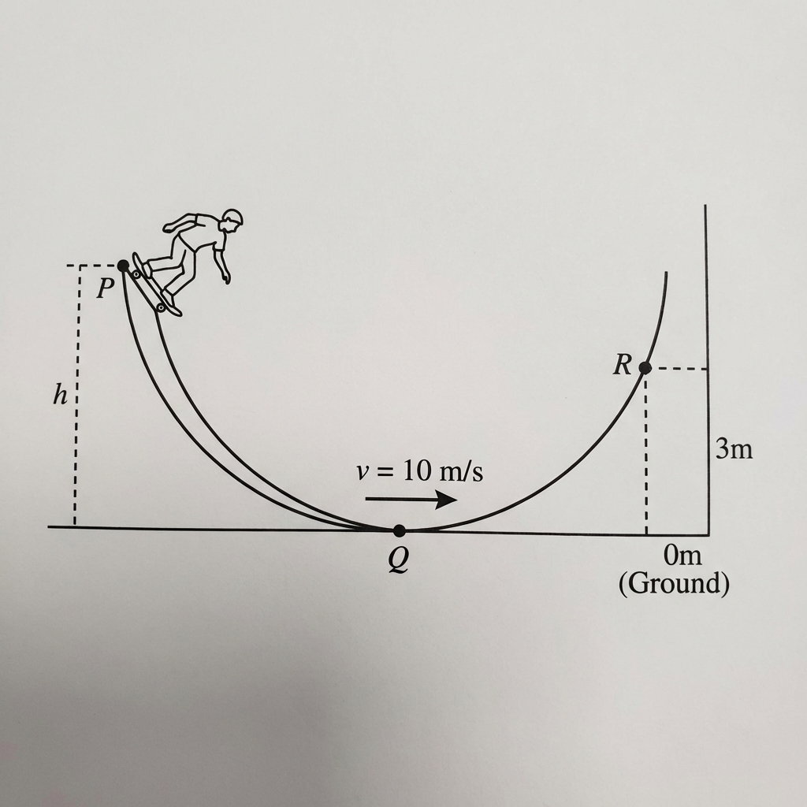

Calculate:
(a) the kinetic energy of Richa at point Q
(b) the vertical height of point P above the ground. (use g as 10 m/s² and neglect friction)
(c) the kinetic energy of Richa at point R. (While moving from Q to R, she loses 500 J of energy against friction.)

---

### Question 7(i) (3 Marks)
Draw a block and tackle system of pulleys with velocity ratio equal to 3.

---

### Question 7(ii) (3 Marks)
A submarine in the sea sends ultrasonic ping and a stopwatch is started simultaneously. The stopwatch stops on receiving the reflected wave from an obstacle and reads 1 minute 40 seconds. Calculate the distance of the obstacle from the submarine (Speed of sound in water 1500 ms⁻¹)

---

---

# SECTION B: CENTRE OF GRAVITY

---

## Year: 2023

### Question 2(ii)(a) (1 Mark)
What is the position of the centre of gravity of a triangular lamina?

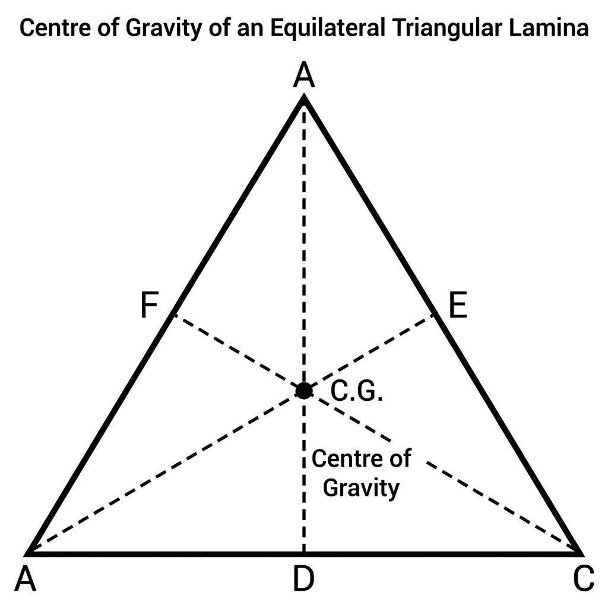

---

### Question 2(ii)(b) (1 Mark)
When this triangular lamina is suspended freely from any one vertex, what is the moment of force produced by its own weight in its rest position?

---

## Year: 2024

### Question 6.1(a) (1 Mark)
Define the centre of gravity of a body.

---

### Question 6.1(b) (2 Marks)
A hollow ice cream cone has height 6 cm.

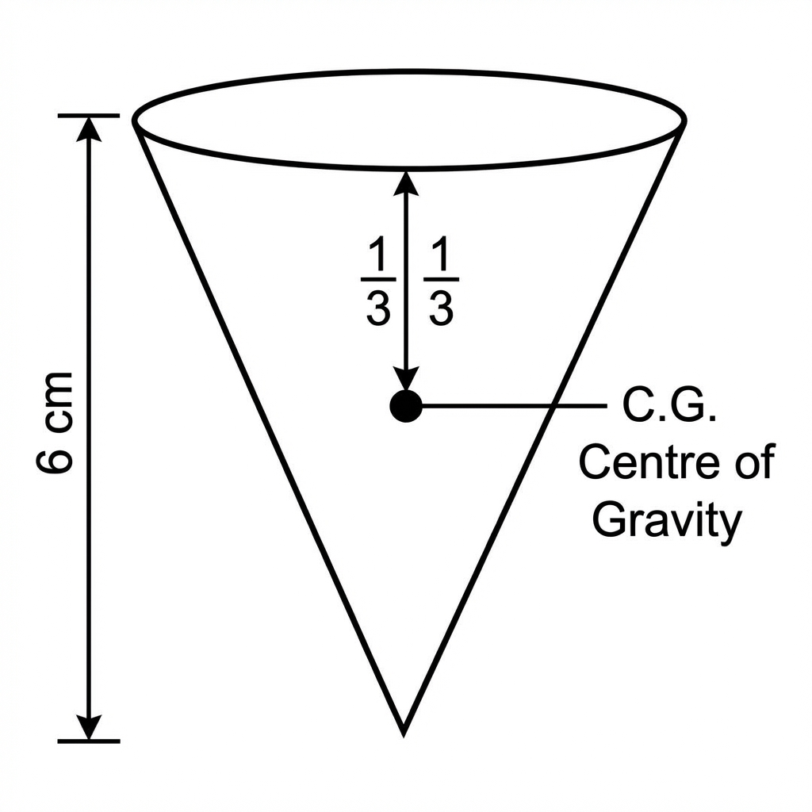

1. Where is the position of its center of gravity from the broad base?
2. Will its position change when it is filled completely with honey? Write Yes or No.

---

## Year: 2025

### Question 2(ii) (2 Marks)
A non-uniform kite is hanging freely from the branch of a tree as shown. Study the figure and answer the following:

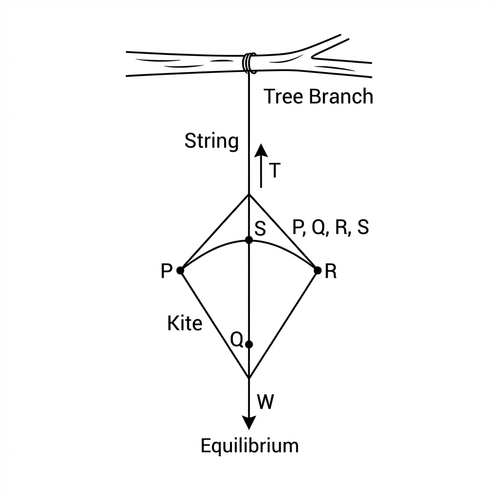

(a) Fill in the blank.
    __________ (P, Q, R or S) is the most probable position of its centre of gravity.

(b) Support your answer to (a) with a reason.

---

---

# SECTION C: UNIFORM CIRCULAR MOTION (CENTRIPETAL & CENTRIFUGAL)

---

## Year: 2020

### Question 1c (2 Marks)
A satellite revolves around a planet in a circular orbit. What is the work done by the satellite at any instant? Give a reason.

---

### Question 5b (3 Marks)
(i) With reference to the direction of action, how does a centripetal force differ from a centrifugal force during uniform circular motion?

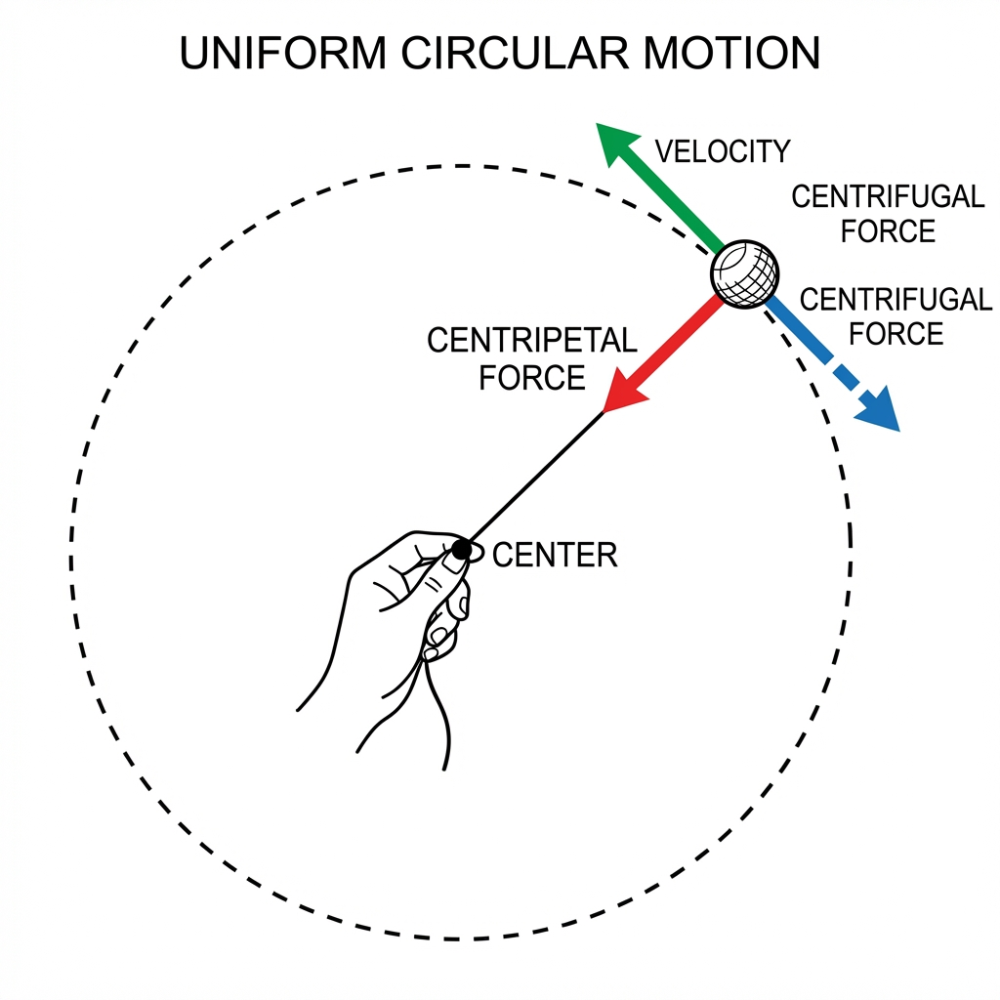

(ii) Is centrifugal force the reaction of centripetal force?

(iii) Compare the magnitude of centripetal and centrifugal force.

---

## Year: 2021

### Question 12 (2 Marks)
A stone tied at the end of a string is whirled by hand in a horizontal circle with uniform speed.

(i) Name the force required for this circular motion:
(a) Centrifugal force.
(b) Centripetal force.
(c) Force of gravity.
(d) Frictional force.

---

### Question 12(ii) (1 Mark)
What is the direction of the above-mentioned force?
(a) Towards the centre of the circular path.
(b) Away from the centre of the circular path.
(c) Normal to the radius at a point where the body is present on the circular path.
(d) Direction of this force keeps on changing alternately towards and away from the centre.

---

## Year: 2024

### Question 2.2(a) (1 Mark)
When a stone tied to a string is rotated in a horizontal plane, the tension in the string provides ______ force necessary for circular motion.

---

### Question 2.2(b) (1 Mark)
Work done by this force at any instant is ______.

---

### Question 6.2 (4 Marks)
Two identical marbles A and B are rolled down along Path 1 and Path 2 respectively.

Path 1 is frictionless and Path 2 is rough.

*[Diagram: Two curved valley-shaped paths - Path 1 (smooth/frictionless) and Path 2 (rough). Both paths have marbles at the starting height, dip to ground level, then rise to a peak.]*

(a) Which marble will surely reach the next peak?

(b) Along which path/s the mechanical energy will be conserved?

(c) Along which path/s is the law of conservation of energy obeyed?

---

## Year: 2025

### Question 2(i)(a) (1 Mark)
Complete the following by choosing the correct answer from the bracket:

In uniform circular motion the centrifugal force acts __________ [towards the centre / away from the centre / along the tangential direction].

---

---

# Quick Reference Summary

| Topic | Total Questions | Years Covered |
|-------|-----------------|---------------|
| Moment of Force & Couple / Equilibrium | 32 | 2019, 2020, 2021, 2023, 2024, 2025 |
| Centre of Gravity | 5 | 2023, 2024, 2025 |
| Uniform Circular Motion | 9 | 2020, 2021, 2024, 2025 |

---

*Note: Only 2 questions have textual diagram descriptions where actual diagrams are pending. All other diagrammatical questions have actual image diagrams included.*

---

**Prepared from ICSE Physics Papers: 2019-2025**
